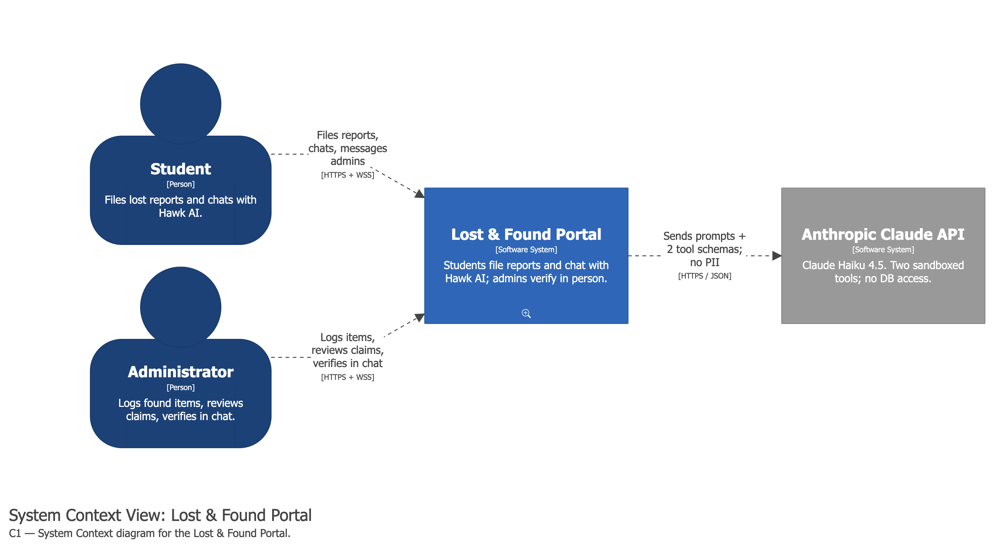
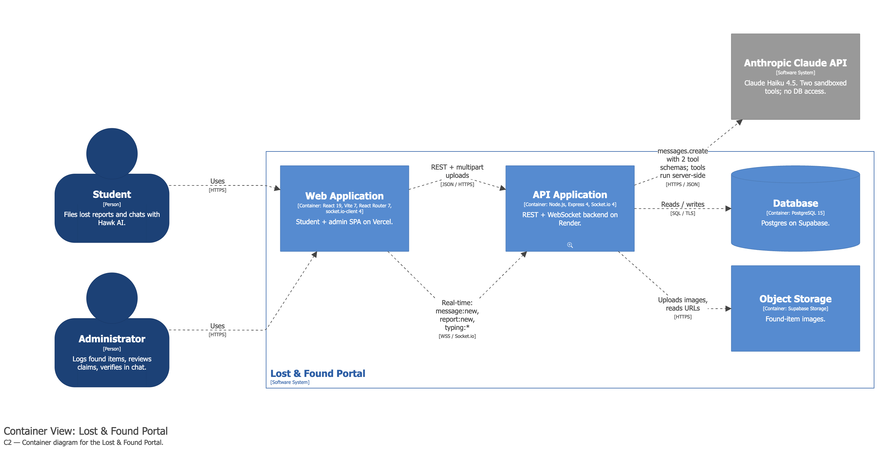
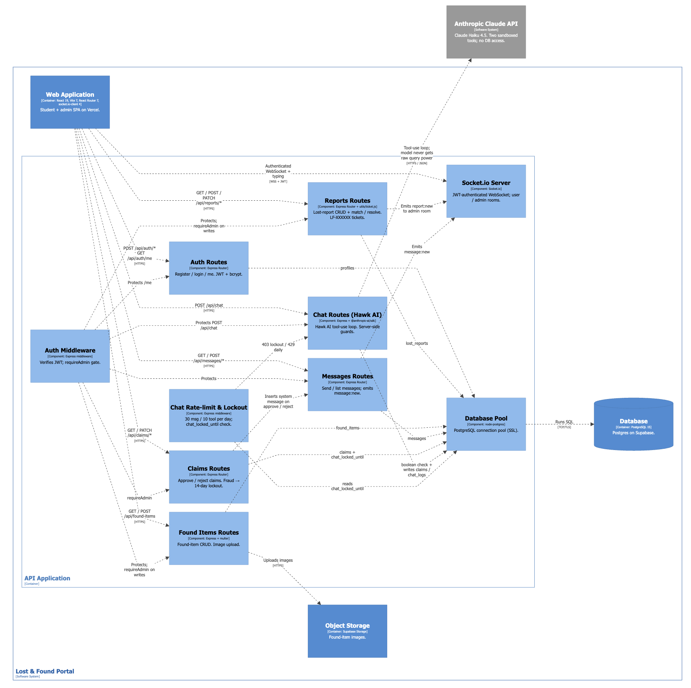

<h1>Capstone — Lost and Found</h1>
<h6>by Jason Shan, Mustafa Kurt, and Raymond Huang</h6>

A web-based **Lost and Found portal for Hunter College** that replaces
the in-person lost-and-found office. Students file lost-item reports
and chat with **Hawk AI** (an LLM-backed assistant) that acknowledges
possible matches and collects structured ownership claims. 

On the Admins end, they can upload lost items that they found or that were turned in to them. They would upload the image, description, and location found of the item to their database. Admins can also start a chat with the student to ask follow-up questions as well as resolve the request if item was returned / picked-up

On the Students' end, they will be able to post details about a lost item chat with admins/AI assistance for further inquiries

🔗 **Live site:** <https://capstone-project-delta-six.vercel.app/>

For the full architecture, security model, data model, end-to-end user
journeys, and Hawk AI internals, see [PURPOSE.md](./PURPOSE.md).

---

## Table of contents

- [Install, set up, and run](#install-set-up-and-run)
- [Repository structure](#repository-structure)
- [Design document (Figma wireframe)](#design-document-figma-wireframe)
- [C4 architecture diagrams](#c4-architecture-diagrams)
- [Code style](#code-style)
- [Citations](#citations)
- [Class instructions](#class-instructions)
- [Milestones](#milestones)

---

## Install, set up, and run

The project is a monorepo with two major components:

- **`lost-and-found/client/`** — React 19 + Vite single-page app (frontend, deployed to Vercel)
- **`lost-and-found/server/`** — Node.js + Express + Socket.IO API (backend, deployed to Render)

### Prerequisites

- Node.js ≥ 18
- npm ≥ 9
- A Postgres database (local Postgres **or** a Supabase project)
- An [Anthropic API key](https://console.anthropic.com/) for Hawk AI

### 1. Clone and install

```bash
git clone https://github.com/rh442/Capstone-LostAndFound.git
cd Capstone-LostAndFound/lost-and-found

# Install client deps
cd client && npm install && cd ..

# Install server deps
cd server && npm install && cd ..
```

### 2. Configure environment variables

**Server** — copy `lost-and-found/server/.env.example` to
`lost-and-found/server/.env` and fill in:

| Variable | Purpose |
|---|---|
| `DB_TARGET` | `local` or `supabase` |
| `DB_HOST`, `DB_PORT`, `DB_NAME`, `DB_USER`, `DB_PASSWORD` | Local Postgres connection (if `DB_TARGET=local`) |
| `SUPABASE_DATABASE_URL`, `SUPABASE_URL`, `SUPABASE_SERVICE_ROLE_KEY` | Supabase connection (if `DB_TARGET=supabase`) |
| `ANTHROPIC_API_KEY` | Powers the Hawk AI chatbot |
| `JWT_SECRET` | Long random string used to sign session JWTs |
| `PORT` | Port the Express server listens on (e.g. `4000`) |

**Client** — create `lost-and-found/client/.env.local` with the API
base URL of your running server, e.g.:

```
VITE_API_URL=http://localhost:4000
```

### 3. Initialize the database

```bash
cd lost-and-found/server
npm run init-db   # runs initDb.js against the DB selected by DB_TARGET
```

This applies `schema.sql` and seeds any required tables.

### 4. Run the app locally

In two terminals:

```bash
# Terminal 1 — backend (http://localhost:4000)
cd lost-and-found/server
npm run dev

# Terminal 2 — frontend (http://localhost:5173)
cd lost-and-found/client
npm run dev
```

Open <http://localhost:5173> in your browser.

### 5. Build for production

```bash
# Client
cd lost-and-found/client
npm run build       # outputs to dist/
npm run preview     # serves the production build locally

# Server
cd lost-and-found/server
npm start
```

Production deployments:

- **Frontend:** Vercel (auto-deploys from `main`) — see `client/vercel.json`
- **Backend:** Render (Node web service) — exposes the REST API and Socket.IO endpoint
- **Database:** Supabase (managed Postgres) — securely saves lost items

---

## Repository structure

```
Capstone-LostAndFound/
├── README.md                       # ← you are here
├── PURPOSE.md                      # full design / architecture / security writeup
├── .gitignore
├── Instructions/                   # class-provided project requirements (PDFs)
├── docs/
│   ├── architecture/
│   │   └── workspace.dsl           # Structurizr DSL — C4 model source
│   └── citations/
│       ├── references.bib          # bibliography (BibTeX)
│       └── citations.tex           # LaTeX file that compiles the bibliography
└── lost-and-found/
    ├── client/                     # React 19 + Vite frontend (deployed to Vercel)
    │   ├── index.html
    │   ├── vite.config.js
    │   ├── vercel.json
    │   ├── eslint.config.js        # ESLint flat config (code style)
    │   ├── package.json
    │   └── src/
    │       ├── main.jsx            # React entry point
    │       ├── App.jsx             # top-level routes
    │       ├── routes/             # route definitions
    │       ├── pages/              # page-level components (student/admin)
    │       ├── components/         # shared UI components
    │       ├── context/            # React context providers (auth, etc.)
    │       ├── lib/                # API client + Socket.IO helpers
    │       ├── styles/             # global CSS
    │       └── assets/             # images, icons, fonts
    └── server/                     # Node + Express + Socket.IO backend (deployed to Render)
        ├── index.js                # Express + Socket.IO entry point
        ├── db.js                   # Postgres / Supabase connection wrapper
        ├── initDb.js               # one-shot DB initializer
        ├── schema.sql              # database schema
        ├── package.json
        ├── .env.example            # template for required env vars
        ├── routes/
        │   ├── auth.js             # register / login / JWT
        │   ├── reports.js          # student lost reports
        │   ├── foundItems.js       # admin found items
        │   ├── claims.js           # ownership claims
        │   ├── messages.js         # student ↔ admin chat
        │   └── chat.js             # Hawk AI chatbot (Anthropic API)
        ├── middleware/
        │   ├── auth.js             # JWT verification + role guard
        │   └── chatLimit.js        # rate limit for Hawk AI
        ├── utils/
        │   └── ticket.js           # LF-XXXXXX ticket-number generator
        └── uploads/                # uploaded item photos (multer)
```

---

## Design document (Figma wireframe)

Wireframes and UI mockups live in Figma:

🔗 [Lost & Found — Wireframes (Figma)](https://www.figma.com/site/xc4gEMIQwfCWy4FeFGjRYH/Lost---Found---Wireframes?node-id=0-1&p=f)

The visual design of the production site is modeled after the
official [Hunter College website](https://hunter.cuny.edu/) so the app
feels consistent with the school's existing web presence (see
[docs/citations/references.bib](./docs/citations/references.bib)).

---

## C4 architecture diagrams

### Context diagram



### Container diagram



### Component diagram



The C4 model source is also available as Structurizr DSL at
[`docs/architecture/workspace.dsl`](./docs/architecture/workspace.dsl).

---

## Code style

The project follows a consistent JavaScript / JSX style based on
**ESLint + Prettier defaults**.

### Linting

The client uses ESLint's flat config (`client/eslint.config.js`) with
the official React and React Hooks plugins:

- `@eslint/js` (recommended rules)
- `eslint-plugin-react-hooks`
- `eslint-plugin-react-refresh`

Run the linter:

```bash
cd lost-and-found/client
npm run lint
```

### Formatting

Code is formatted using **Prettier defaults**:

- 2-space indentation
- Single quotes in JS, double quotes in JSX attributes
- Semicolons at the end of statements
- Trailing commas where valid (ES5+)
- Max line length: 80 characters (soft)

### Naming conventions

- **Components:** `PascalCase` (e.g. `AdminSidebar.jsx`, `ItemCell.jsx`)
- **Hooks / utilities / variables:** `camelCase` (e.g. `useAuth`, `ticket.js`)
- **CSS files:** mirror the component name (`AdminSidebar.css` next to `AdminSidebar.jsx`)
- **Database columns:** `snake_case` (Postgres convention)
- **Environment variables:** `SCREAMING_SNAKE_CASE`
- **Branches:** kebab-case, scoped by feature (e.g. `auth`, `feat/claims-tickets-messaging-security`)

### Commits

Short, imperative commit messages (e.g. `add admin overview page`,
`fix JWT refresh edge case`). Long-form context goes in the body or
the PR description.

---

## Citations

All external contributions (APIs, AI tools, fonts, hosting providers,
design inspiration, images) are documented in
[`docs/citations/`](./docs/citations/):

- [`references.bib`](./docs/citations/references.bib) — BibTeX bibliography
- [`citations.tex`](./docs/citations/citations.tex) — compiles the bibliography

To build a PDF of the citations:

```bash
cd docs/citations
pdflatex citations.tex
bibtex citations
pdflatex citations.tex
pdflatex citations.tex
```

---

## Class instructions

- [Project Requirements](https://github.com/rh442/Capstone-LostAndFound/blob/main/Instructions/Project%20Requirements.pdf)
- [Weekly Presentation Requirements](https://github.com/rh442/Capstone-LostAndFound/blob/main/Instructions/Project%20Update%20Guidelines.pdf)

---

## Milestones

| Week | Goal |
|------|------|
| [1](https://cuny620-my.sharepoint.com/:p:/g/personal/raymond_huang70_myhunter_cuny_edu/IQBg71lJ6p1RR5FRrlFN2Pw0AQ9rekMiKHYjQJOYXve5LE0?e=2mqq5r) | GitHub setup and initial research |
| [2](https://cuny620-my.sharepoint.com/:p:/g/personal/raymond_huang70_myhunter_cuny_edu/IQAU83Bg1E7RSanBrGrk4iVCAQ9m9hHATvrJimxgqgUaOtk?e=JFFJPg) | Student Dashboard + Student Lost Items + Admin Dashboard pages complete |
| [3](https://cuny620-my.sharepoint.com/:p:/g/personal/raymond_huang70_myhunter_cuny_edu/IQBnodCpBA5FRI-KHmZv_b_6Ae7gcwWEInTL0Kh_Q_ST5PQ?e=yTBsDD) | Student Report + Student Messages + Admin Message + Admin New Item pages completed |
| [4](https://cuny620-my.sharepoint.com/:p:/g/personal/raymond_huang70_myhunter_cuny_edu/IQBGSoETWSblRZGVpp1cN1P-AamR0R4XRdMsY7FflIoajrY?e=YOv9Kd) | Home page UI updated + Admin Overview page started |
| [5](https://cuny620-my.sharepoint.com/:p:/g/personal/raymond_huang70_myhunter_cuny_edu/IQDw7pkbj-19TJYokc02zUmrAWB7ZWY1GgAvDkh_Wu9f1Fs?e=qo6Xm9) | Auth + Admin updates + UI updates |
| [6](https://cuny620-my.sharepoint.com/:p:/g/personal/raymond_huang70_myhunter_cuny_edu/IQB2FTmKT_Z9S4-BuZOTTqmMAX9yFRxare-1si0trleuKRg?e=XHCFm6) | Account creation + login + more UI updates |
| [7](https://cuny907-my.sharepoint.com/:p:/g/personal/raymond_huang70_login_cuny_edu/IQAP4Wz12DUDSLJ2LmtQf25EAY095sY4Fw1yLsf2F0Oyu-g?e=A6kFKr) | Backend + database |
| [8](https://cuny907-my.sharepoint.com/:p:/g/personal/raymond_huang70_login_cuny_edu/IQCsvTYL9ICWQ6IBepEZO_CJAU0UsLIyirK49bMqHfiSu2w?e=2mqM4x) | Hosting + mock data |
